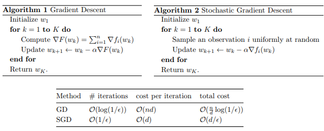

```{r setup, include=FALSE}
knitr::opts_chunk$set(echo = FALSE)
```

# Framing: Key ML Terminology

##  Table of Contents


- (supervised) machine learning
- Labels
- Features
- Examples
- Models
- Regression vs. classification
- More key terms
- Check your understanding

## Supervised machine learning

What is (supervised) machine learning? Concisely put, it is the following:

Machine Learning  systems learn how _to_  __combine input__ _to_  __produce useful predictions__ on never-before-seen data.

Let's explore fundamental machine learning terminology.

##  Labels

A label is the thing we're predicting -- the $y$ variable in simple linear regression. The label could be the future price of wheat, the kind of animal shown in a picture, the meaning of an audio clip, or just about anything.

##  Features

A __feature__ is an input variable -- the $x$ variable in simple linear regression. A simple machine learning project might use a single feature, while a more sophisticated machine learning project could use millions of features, specified as:

$$
x_1,x_2,x_3,...,x_N
$$

In a spam detector example, the features could include the following:

- words in the email text

- sender's address

- time of day the email was sent

- email contains the phrase "your bank account"


## Examples

An __example__ is a particular instance of data, $\mathbf{x}$. (We put $\mathbf{x}$ in boldface to indicate that it is a vector.) We break examples into two categories:

labeled examples

unlabeled examples

A __labeled example__ includes both feature(s) and the label. That is:

labeled examples: $\{features, label\}: (x, y)$

Use labeled examples to train the model. In our spam detector example, the labeled examples would be individual emails that users have explicitly marked as "spam" or "not spam."

## Examples

For example, the following table shows 5 labeled examples from a [data set](https://developers.google.com/machine-learning/crash-course/california-housing-data-description) containing information about housing prices in California:

<center></center>


## Examples

An unlabeled example contains features but not the label. That is:
  
unlabeled examples: $\{features, ?\}: (x, ?)$

Here are 3 unlabeled examples from the same housing dataset, which exclude _medianHouseValue_:

<center></center>


Once we've trained our model with labeled examples, we use that model to predict the label on unlabeled examples. In the spam detector, unlabeled examples are new emails that humans haven't yet labeled.

## Models

A __model__ defines the relationship between features and label. For example, a spam detection model might associate certain features strongly with "spam". Let's highlight two phases of a model's life:

* __Training__ means creating or learning the model. That is, you show the model labeled examples and enable the model to gradually learn the relationships between features and label.

* __Inference__ or __Scoring__ means applying the trained model to unlabeled examples. That is, you use the trained model to make useful predictions $y$. For example, during inference, you can predict _medianHouseValue_ for new unlabeled examples.


## Regression vs. classification

A __regression__ model predicts continuous values. For example, regression models make predictions that answer questions like the following:

* What is the value of a house in California?

* What is the probability that a user will click on this ad?

A __classification__ model predicts discrete values. For example, classification models make predictions that answer questions like the following:

* Is a given email message spam or not spam?

* Is this an image of a dog, a cat, or a hamster?

## More about key terms


+ [label](https://developers.google.com/machine-learning/crash-course/glossary#label)

+ [feature](https://developers.google.com/machine-learning/crash-course/glossary#feature)

+ [example](https://developers.google.com/machine-learning/crash-course/glossary#example)

+ [model](https://developers.google.com/machine-learning/crash-course/glossary#model) 

+ [regression model](https://developers.google.com/machine-learning/crash-course/glossary#regression_model)

+ [classification model ](https://developers.google.com/machine-learning/crash-course/glossary#classification_model) 

+ [training](https://developers.google.com/machine-learning/crash-course/glossary#training)

+ [inference](https://developers.google.com/machine-learning/crash-course/glossary#inference)


## Check your understanding

### Supervised Learning

Explore the options below.

Suppose you want to develop a supervised machine learning model to predict whether a given email is "spam" or "not spam." Which of the following statements are true?

- Emails not marked as "spam" or "not spam" are unlabeled examples.
- Words in the subject header will make good labels.
- The labels applied to some examples might be untrustworthy.
- We'll use unlabeled examples to train the model

## Check your understanding

### Features and Labels

Explore the options below.

Suppose an online shoe store wants to create a supervised ML model that will provide personalized shoe recommendations to users. That is, the model will recommend certain pairs of shoes to Marty and different pairs of shoes to Janet. Which of the following statements are true?

- Shoe size is a useful feature.
- Shoe beauty is a useful feature.
- User clicks on a shoe's description is a useful label.
- The shoes that a user adores is a useful label.


# Descending into Machine Learning

## Linear Regression

 It has long been known that crickets (an insect species) chirp more frequently on hotter days than on cooler days.  For decades, professional and amateur scientists have cataloged data on chirps-per-minute and temperature.  As a birthday gift, your Aunt Ruth gives you her cricket database and asks you to learn a model to predict this relationship. Using this data, you want to explore this relationship.

First, examine your data by plotting it:

{width=40%}


## Linear Regression

As expected, the plot shows the temperature rising with the number of chirps. Is this relationship between chirps and temperature linear? Yes, you could draw a single straight line like the following to approximate this relationship:

{width=40%}

## Linear Regression

True, the line doesn't pass through every dot, but the line does clearly show the relationship between chirps and temperature. Using the equation for a line, you could write down this relationship as follows:

$$
y = mx + b
$$

where:

- $y$ is the temperature in Celsius-the value we're trying to predict.
- $m$ is the slope of the line.
- $x$ is the number of chirps per minute-the value of our input feature.
- $b$ is the y-intercept.

## Linear Regression 

By convention in machine learning, you'll write the equation for a model slightly differently:

$y= b+w_1x_1$ 


where:

- $y$ is the predicted label (a desired output).
- $b$ is the bias (the y-intercept), sometimes referred to as .
- $w_1$ is the weight of feature 1. Weight is the same concept as the "slope"  in the traditional equation of a line.
- $x_1$ is a feature (a known input).


To __infer__ (predict) the temperature  $y$ or a new chirps-per-minute value $x_1$, just substitute the  value into this model.

## More about key terms


+ [Bias](https://developers.google.com/machine-learning/glossary#bias)
+ [Linear regression](https://developers.google.com/machine-learning/glossary#linear_regression)
+ [Inference](https://developers.google.com/machine-learning/glossary#inference)
+ [Weight](https://developers.google.com/machine-learning/glossary#weight)

## Training and Loss 


+ _Training_ a model simply means learning (determining) good values for all the weights and the bias from labeled examples. 

In supervised learning, a machine learning algorithm builds a model by examining many examples and attempting to find a model that minimizes loss; this process is called empirical risk minimization.


+ _Loss_ is the penalty for a bad prediction. That is, _loss_ is a number indicating how bad the model's prediction was on a single example. If the model's prediction is perfect, the loss is zero; otherwise, the loss is greater. The goal of training a model is to find a set of weights and biases that have low loss, on average, across all examples. 

## Training and Loss 

For example, Figure 3 shows a high loss model on the left and a low loss model on the right. Note the following about the figure:

+ The red arrow represents loss.
+ The blue line represents predictions.

{width=80%}


## Squared loss: a popular loss function 
 
The linear regression models we'll examine here use a loss function called squared loss (also known as L2 loss). The squared loss for a single example is as follows:

Mean square error (MSE) is the average squared loss per example over the whole dataset. To calculate MSE, sum up all the squared losses for individual examples and then divide by the number of examples:
 
 $$ 
 MSE = \frac{1}{N} \sum_{(x,y) \in D}(y-predictions)^2
 $$
Where:


## Squared loss: a popular loss function

 - $(x,y)$ is an example in which  
    + $x$ is the set of features (for example, chirps/minute, age, gender) that the model uses to make predictions.
    + $y$ is the example's label (for example, temperature).
    + $predictions(x)$ is a function of the weights and bias in combination with the set of features .
    + $D$ is a data set containing many labeled examples, which are  pairs.
    + $N$ is the number of examples in .
Although MSE is commonly-used in machine learning, it is neither the only practical loss function nor the best loss function for all circumstances

## Squared loss: a popular loss function


### Key Terms

+ [empirical risk minimization](https://developers.google.com/machine-learning/glossary#ERM)
+ [loss](https://developers.google.com/machine-learning/glossary#loss)
+ [mean squared error](https://developers.google.com/machine-learning/glossary#MSE)
+ [squared loss](https://developers.google.com/machine-learning/glossary#squared_loss)
+ [training](squared loss)
 
## Check Your Understanding
 
Consider the following two plots: Which of the two data sets shown in the preceding plots has the higher Mean Squared Error (MSE)?

{width=100%}


## Reducing Loss: an iterative approach

The following figure suggests the iterative trial-and-error process that machine learning algorithms use to train a model:

{width=80%}


## Reducing Loss: an iterative approach

Consider a model that takes one feature and returns one prediction:

$$
y = y= b+w_1x_1
$$

What initial values should we set $b$ for and $b_1$ ? For linear regression problems, it turns out that the starting values aren't important. We could pick random values, but we'll just take the following trivial values instead:

+ $b = 0$
+ $w_1 = 0$


## Reducing Loss: an iterative approach

Suppose that the first feature value is 10. Plugging that feature value into the prediction function yields:

```
y = 0 + 0(10)
y = 0
```

The "Compute Loss" part of the diagram is the loss function that the model will use. Suppose we use the squared loss function. The loss function takes in two input values:

$y'$ The model's prediction for features x
$y$ The correct label corresponding to features x.


## Reducing Loss: Gradient Descent

{width=50%}


## Reducing Loss: Gradient Descent

{width=50%}


## Reducing Loss: Gradient Descent


{width=50%}


## Reducing Loss: Gradient Descent

{width=50%}


## Reducing Loss: Learning Rate


 {width=50%}

## Reducing Loss: Learning Rate


 {width=50%}


## Reducing Loss: Learning Rate

 {width=50%}


## Optimizing Learning Rate

+ [Experiment with different learning rates](https://developers.google.com/machine-learning/crash-course/fitter/graph) and see how they affect the number of steps required to reach the minimum of the loss curve. 

+ Try the exercises below the graph.


## Reducing Loss: Stochastic Gradient Descent


+ In gradient descent, a __batch__ is the total number of examples you use to calculate the gradient in a single iteration. So far, we've assumed that the batch has been the entire data set.

+ A very large batch may cause even a single iteration to take a very long time to compute.

+ What if we could get the right gradient on average for much less computation? By choosing examples at random from our data set, we could estimate (albeit, noisily) a big average from a much smaller one.

+ __Stochastic gradient descent (SGD)__ takes this idea to the extreme--it uses only a single example (a batch size of 1) per iteration. Given enough iterations, SGD works but is very noisy. The term "stochastic" indicates that the one example comprising each batch is chosen at random.

## Gradient Descent vs Stochastic Gradient Descent the math 

{width=100%}


## Reducing Loss: key terms


+ [batch](https://developers.google.com/machine-learning/glossary#batch)

+ [batch size](https://developers.google.com/machine-learning/glossary#batch_size)

+ [mini-batch](https://developers.google.com/machine-learning/glossary#mini-batch)

+ [stochastic gradient descent (SGD)](https://developers.google.com/machine-learning/glossary#SGD)

## [Reducing Loss: Playground Exercise](https://developers.google.com/machine-learning/crash-course/reducing-loss/playground-exercise)

