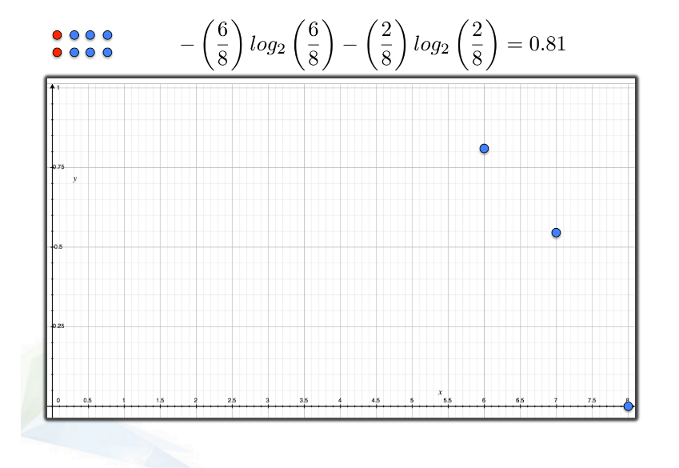
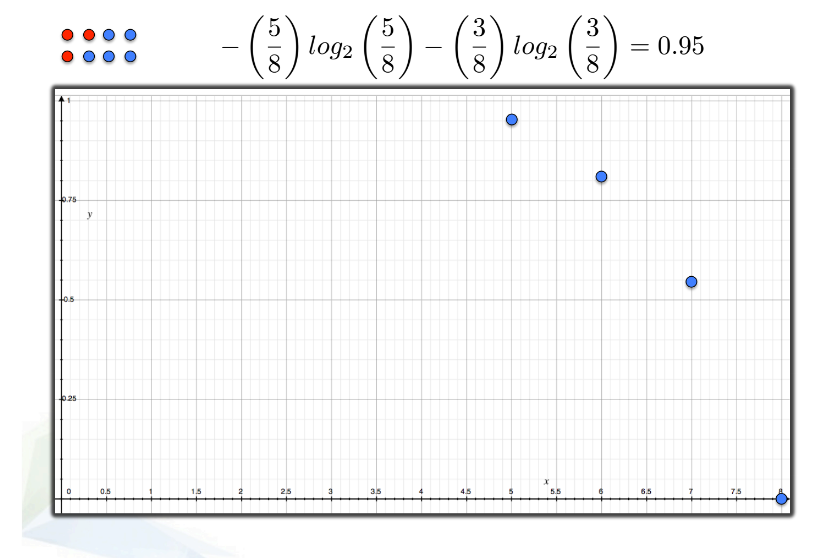
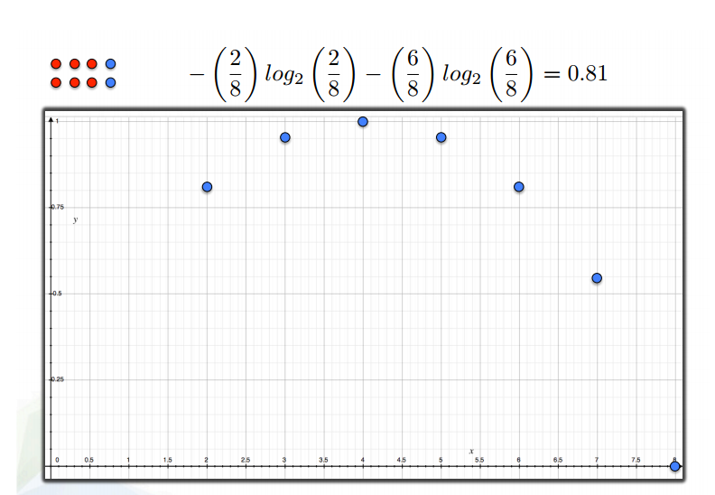
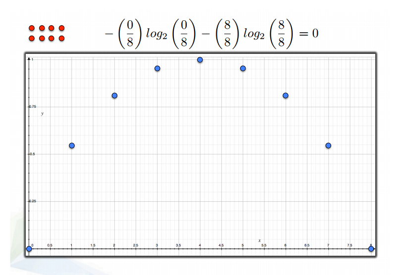
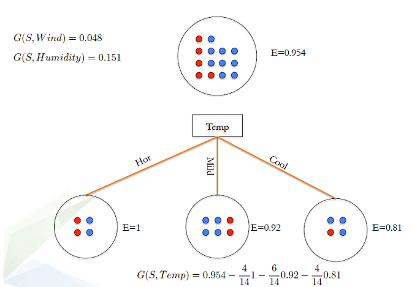

```{r setup, include=FALSE}
knitr::opts_chunk$set(echo = FALSE)
```

## Aims of this lesson

* Understand what are decision trees (DT), random forests (RF) and gradient boosting (GB), how they works, and how to evaluate a DT a RF or a GB model.

* Decision tree is a type of supervised learning algorithm (having a pre-defined target variable) mostly used in classification problems.

* It works for both categorical and continuous input and output variables.

* In this technique, we split the population or sample into two or more homogeneous sets (or sub-populations) based on most significant splitter$/$differentiator in input variables.

# Decision trees
## A decision tree example 

{width=60%}

## A decision tree example 

{width=60%}

## A decision tree example 

{width=70%}


## A decision tree example 


{width=70%}


## A decision tree example 


{width=70%}

## A decision tree example 


{width=70%}


## Types of decision trees

+ __Classification decision tree:__ Decision trees which have categorical target variable

    + Models suitable for answering questions: Which category(ies)  


+ __Regression trees:__ decision trees that have continuous target variable 

    + Models suitable for answering questions: How mach, how many 
     
##  Terminology related to decision trees
 
1. __Root Node:__ It represents entire population or sample and this further gets divided into two or more homogeneous sets.

2. __Splitting:__ It is a process of dividing a node into two or more sub-nodes.

3. __Decision Node:__ When a sub-node splits into further sub-nodes, then it is called decision node.

4. __Leaf/ Terminal Node:__ Nodes do not split is called Leaf or Terminal node.

5. __Pruning:__ When we remove sub-nodes of a decision node, this process is called pruning. You can say opposite process of splitting.

6. __Branch / Sub-Tree:__ A sub section of entire tree is called branch or sub-tree.

7. __Parent and Child Node:__ A node, which is divided into sub-nodes is called parent node of sub-nodes where as sub-nodes are the child of parent node.


##  Terminology related to decision trees


{width=70%}


## Advantages & disadvantages

### Advantages 


+ Easy to Understand:

+ Useful in data exploration: 

+ Less data cleaning required.

+ Data type is not a constraint.

+ Non parametric method.


### Disadvantages

+ Over fitting

+ Not fit for continuous variables


## How does a tree decide where to split?

{width=70%}


## How does a tree decide where to split?

{width=70%}


## How does a tree decide where to split?

{width=70%}


## How does a tree decide where to split?

{width=70%}


## How does a tree decide where to split?

{width=70%}


## How does a tree decide where to split?

{width=70%}

## How does a tree decide where to split?

{width=70%}


## How does a tree decide where to split?

{width=70%}


## How does a tree decide where to split?

{width=70%}


## How does a tree decide where to split?

{width=70%}


## How does a tree decide where to split?

{width=70%}


## How does a tree decide where to split?

{width=70%}


## How does a tree decide where to split?

{width=70%}


## How does a tree decide where to split?

{width=70%}


## How does a tree decide where to split?

{width=30%} 


## How does a tree decide where to split?

{width=50%}

## How does a tree decide where to split?

{width=50%}


## How does a tree decide where to split?

{width=50%}


## key parameters of tree modeling

+ Overfitting is one of the key challenges faced while modeling decision trees. 

+ If no limit set,  tree give you 100% accuracy on training set

+ Preventing overfitting is essential in fitting  a decision tree and it can be done in 2 ways:

    * Setting constraints on tree size
    * Tree pruning


## Setting constraints on tree size

{width=70%}

## Setting constraints on tree size

1. Minimum samples for a node split (`min_samples_split`)

    + Control over-fitting. Should be tuned using CV.

2. Minimum samples for a terminal node (leaf)

    + Control over-fitting similar to min_samples_split.

3. Maximum depth of tree (vertical depth, `max_depth`)

    + Control over-fitting Should be tuned using CV
    
4. Maximum number of terminal nodes
    
    + Can be defined in place of `max_depth`. In a binary tree, a depth of 'n' would produce a maximum of $2^{n+1} -1$ leaves.

5. Maximum features to consider for split


## Tree pruning

1. Make the decision tree to a large depth.

2. Start at the bottom and start removing leaves which are giving us negative IG when compared from the top.


Suppose a split is giving us a gain of say -10 (loss of 10) and then the next split on that gives us a gain of 20. A simple decision tree will stop at step 1 but in pruning, we will see that the overall gain is +10 and keep both leaves.


## Are tree based models better than logistic  models?

+ If the relationship between feature and label is well approximated by a linear model, linear regression will outperform tree based model.

+ If there is a high non-linearity andcomplex relationship between feature and label tree model will outperform a classical regression method.

+ If you need to build a model which is easy to explain to people, a decision tree model will always do better than a linear model. Decision tree models are even simpler to interpret than linear regression!


## Working with decision trees in R


__Go to the notebook__
