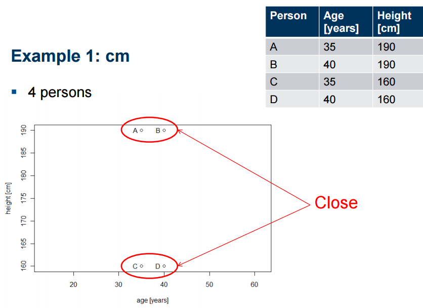
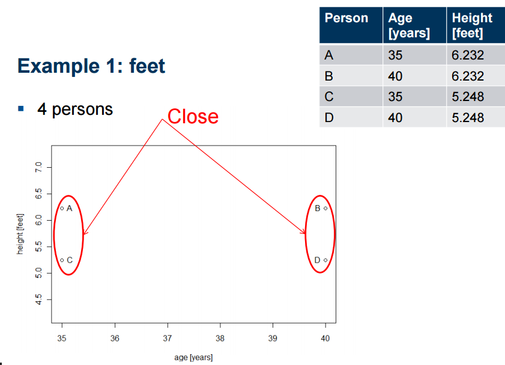
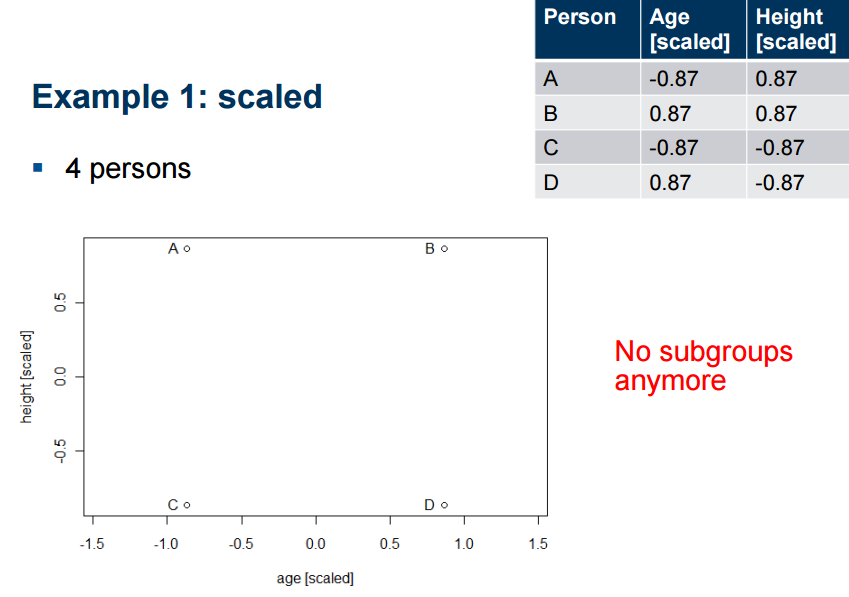
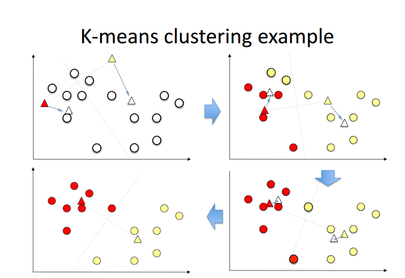

```{r setup, include=FALSE}
library(factoextra)
knitr::opts_chunk$set(echo = FALSE)
```


## Aims of this lesson 

+ Introduce you to the clustering algorithms and evaluation

+ Give some application examples 


## Introduction

+ unsupervised ML algorithms. Why unsupervised ?

+ The model is trained based on given input variables which attempt to discover intrinsic groups (or clusters). 

+ Clustering algorithms are widely used across all industries such as retail, banking, manufacturing, healthcare, etc. 

+ Separate customers sharing similar characteristics. 

+ Extract abnormal observations


## Types of Clustering Techniques

+ Many types of clustering algorithms exist. Among these different clustering algorithms, there exists clustering behaviors known as

+ Model based clustering: In this technique, the probability or likelihood of an observation being partitioned into a cluster is calculated.

+ Non-parametric clustering: an observation is partitioned into exactly one cluster (no probability is calculated).


## Distance calculation for clustering

1. Distance calculations for quantitative variables are highly influenced by variable units and magnitude. Standardize!

2. Use of a particular distance measure depends on the variable types.

Suppose, we are given a 2-dimensional data with 

$$X = (x_1, x_2,\cdots,x_p)$$ 
and 
$$Y = (y_1, y_2, \cdots, y_p)$$
We can calculate various distances as follows:


## Distance calculation for clustering

### Numeric variables

* Euclidean Distance: $d(X,Y) = \sum (x_i -y_i)^2$

* Manhattan Distance: $d(X,Y) = \sum |x_i -y_i|$     


### Catergorical variables 

Hamming Distance: $d(x, y) = \sum(x_i \neq  y_i)$


### Mixed variables

* Gower Distance

* Cosine Similarity 

 
## Distance calculation for clustering

1. `Julie loves me more than Linda loves me`

2. `Jane likes me more than Julie loves me`

List of the words from both texts

`me Julie loves Linda than more likes Jane`

```
words         frequency 1      frequency 2  
--------------------------------------------
me                2                2   
Jane              0                1 
Jullie            1                0
Linda             0                1
likes             0                1
loves             2                1  
more              1                1
than              1                1  
```
## Distance calculation for clustering

### Cosine Similarity 

The two vectors are, again:

```
a: [2, 1, 0, 2, 0, 1, 1, 1]

b: [2, 1, 1, 1, 1, 0, 1, 1]
```

$$ \text{cos-similarity}(X,Y) = \cos(X, Y) = \frac{X . Y}{||X||.||Y||} $$

The cosine of the angle between $a$ and $b$ is about 0.822.


## Why Standardization?
 

{width=60%} 


## Why Standardization?
 
 {width=60%}

## Why Standardization?
 
{width=60%}


# K-means clustering
## K-means clustering:  How does it work ?

* Input: $K$, set pf points $x_1,\cdots,x_n$

* Place random centroids $c_1,\cdots,c_k$ at random locations 

* Repeat until convergence: 
  
    + for each point $x_i$: 
        + find nearest centroid $c_j$ 
        + assign the point $x_i$ to cluster $c_j$
    + for each cluster $c_1,\cdots,c_k$    
        + compute new centroid $c_j =$ mean of all points $x_i$
        + assign the new centroid  to the cluster $j$ in the previous step 
        
* Stop when none of the cluster assignments change 

## K-means clustering:  How does it work ?

{width=60%}


## K-means clustering in R 

Function `kmeans` from package `kmeans`
 
```
kmeans(x, centers, iter.max = 10, nstart = 1)
```

* _x_: numeric matrix, numeric data frame or a numeric vector
* _centers:_ Possible values are the number of clusters (k) or a set of initial cluster centers. 
* _iter.max:_ The maximum number of iterations allowed. Default value is 10.
* _nstart:_ The number of random starting partitions when centers is a number. 


## K-means clustering in R 

`kmeans()` from package `kmeans` function returns a list including:


* _cluster:_ a vector of integers (from `1:k`) indicating the cluster to which each point is allocated.
* _centers:_ a matrix of cluster centers.
* _withinss:_ vector of within-cluster sum of squares, one component per cluster.
* _tot.withinss:_ total within-cluster sum of squares. That is, `sum(withinss)`.
* _size:_ the number of points in each cluster.

## K-means clustering in R 

```{r echo=TRUE}
set.seed(123)
# Two-dimensional data format
df <- rbind(matrix(rnorm(100, sd = 0.3), ncol = 2),
           matrix(rnorm(100, mean = 1, sd = 0.3), 
           ncol = 2))
colnames(df) <- c("x", "y")
head(df,5)

```

## K-means clustering in R 

The R code below performs k-means clustering with k = 2:


```{r echo=TRUE}
# Compute k-means
set.seed(123)
km.res <- kmeans(df, 2, nstart = 25)
# Cluster number for each of the observations
km.res$cluster

```


## K-means clustering in R 

```{r echo=TRUE}
# Cluster size
km.res$size

# Cluster means
km.res$centers

```

It's possible to plot the data with coloring each data point according to its cluster assignment. The cluster centers are specified using "big stars":

## K-means clustering in R 

```{r echo=TRUE, fig.height = 3, fig.width = 5}
plot(df, col = km.res$cluster, pch = 19, frame = FALSE,
     main = "K-means with k = 2")
points(km.res$centers, col = 1:2, pch = 8, cex = 3)

```


## K-means clustering in R 

```{r echo=TRUE, fig.height = 3, fig.width = 5}

km.res <- kmeans(df, 4, nstart = 25)
plot(df, col = km.res$cluster, pch = 19, frame = FALSE,
     main = "K-means with k = 4")
points(km.res$centers, col = 1:4, pch = 8, cex = 3)


```


## K-means clustering in R 


```{r echo=TRUE}
# Print the result
km.res
```

## K-means clustering in R 

```{r echo=TRUE}
set.seed(123)
# K-means with nstart = 1
km.res <- kmeans(df, 4, nstart = 1)
km.res$tot.withinss

# K-means with nstart = 25
km.res <- kmeans(df, 4, nstart = 25)
km.res$tot.withinss

```

## Predict memberships

```{r echo=TRUE}
#load the libeary clue and use the function cl_predict
library(clue) 
nr  <- nrow(df)
#choose a random 90% sample 
ind <- sample(nr, 0.9 * nr, replace = FALSE)
km.res <- kmeans(df[ind, ], 2, nstart = 25)
cl_predict(km.res, df[-ind, ]) 

```

## How to choose  `k`

```{r echo=TRUE, fig.height = 3, fig.width = 5}
fviz_nbclust(df, kmeans, method = "wss") + 
  geom_vline(xintercept = 2, linetype = 4) + 
  labs(subtitle = "Elbow method")

```


## Drawbacks of K-means

1. Need to choose the right `k`

2. Cannot Handle Noise Data and Outliers

3. Cannot Handle Non-spherical Data

__Pleae complete clustering_algorithms_lab.Rmd (kmeans section)__ 

 
# DBSCAN: Density-Based Spatial Clustering Algorithm with Noise 

## Preliminary: $\epsilon$-Balls and neighborhood density

For some $\epsilon > 0$  and some point $p$, the $\epsilon$-neighborhood of $p$ is defined as the set of points that are at most distance $\epsilon$ away from $p$.


## Preliminary: $\epsilon$-Balls and neighborhood density


{width=60%}

## Preliminary: $\epsilon$-Balls and neighborhood density


{width=60%}


## Preliminary: $\epsilon$-Balls and neighborhood density


{width=60%}

## Preliminary: $\epsilon$-Balls and neighborhood density


{width=30%}
$$
density = \frac{mass}{volume}
$$

$mass = 31$. 

$volume = \pi \times 0.5^2 = \frac{\pi}{4}$  

Therefore, our local density approximation at $p = (3,2)$ is calculated as $density = mass/volume = 31/\frac{\pi}{4} = 124/\pi ~= 39.5.$


## Preliminary: $\epsilon$-Balls and neighborhood density

* This value is meaningless by itself, but if we calculate the local density approximation for all points in our dataset

* we could cluster our points by saying that points that are nearby (contained in the same neighborhood) and have similar local density approximations belong in the same cluster.If we decrease the value of $\epsilon$ we can construct smaller neighborhoods (less volume) that would also contain fewer data points. 

* Ideally, we want to identify highly dense neighborhoods where most of the data points are contained in these neighborhoods, but the volume of each of these neighborhoods is relatively small.

While this is not exactly what DBSCAN does, it forms the general intuition behind density-based clustering.


## DBSCAN


The $\epsilon$-neighborhood is fundamental to DBSCAN to approximate local density, so the algorithm has two parameters:

* $\epsilon$: The radius of our neighborhoods around a data point p.
minPts: The minimum number of data points we want in a neighborhood to define a cluster.

* _minPts_: The minimum number of data points we want in a neighborhood to define a cluster.


Using these two parameters, DBSCAN categories the data points into three categories:


## DBSCAN

* _Core Points_: A data point $p$ is a core point if __Nbhd__$(p,\epsilon)$ [$\epsilon-$neighborhood of p] contains at least minPts ; __Nbhd__$(p,\epsilon)$ $>= minPts$.


* _Border Points_: A data point $q$ is a border point if _Nbhd_$(p,\epsilon)$ contains less than _minPts_ data points, but $q$ is reachable from some core point $p$.

* _Outlier_: A data point $O$ is an outlier if it is neither a _core point_ nor a _border point_. Essentially, this is the "other" class.


## DBSCAN: Border Points

{width=60%}


The three points in __Nbhd__$(p,\epsilon)$ are said to be directly reachable from $p$


## DBSCAN: Border Points


{width=60%}


## DBSCAN: Border Points

{width=60%}


If I can get to the point $r$ by jumping from neighborhood to neighborhood, starting at a point $p$, then the point r is _density-reachable_ from the point $p$.

## DBSCAN: Outliers

Outliers are points that are neither core points nor are they close enough to a cluster to be _density-reachable_ from a core point. Outliers are not assigned to any cluster and, depending on the context, may be considered anomalous points.

Now that I have covered all the preliminaries, we can finally talk about how the algorithm works in practice.


## DBSCAN algorithm

* Pick a point at random that has not been assigned to a cluster or been designated as an outlier. Compute its neighborhood to determine if it's a core point. If yes, start a cluster around this point. If no, label the point as an outlier.

* Once we find a core point and thus a cluster, expand the cluster by adding all directly-reachable points to the cluster. Perform "neighborhood jumps" to find all density-reachable points and add them to the cluster. If an an outlier is added, change that point's status from outlier to border point.

* Repeat these two steps until all points are either assigned to a cluster or designated as an outlier.


## DBSCAN R implementation 

We need the packages `fpc`;`dbscan` and `factoextra` 

To determine the optimal value of $\epsilon$ we use the functionwe use  

``` 
dbscan::kNNdistplot(data, k = minPts)
```

Compute DBSCAN using `fpc::dbscan()` or `dbscan::dbscan()`.


```
# fpc package
res.fpc <- fpc::dbscan(data, eps = espsilon, MinPts = k)
# dbscan package
res.db <- dbscan::dbscan(data, eps = espsilon, MinPts = k)
```
## DBSCAN R implementation 

* The result of the function `fpc::dbscan()` and provides an object of class 'dbscan' containing the following components:
    + cluster: integer vector coding cluster membership with noise observations (singletons) coded as 0
    + isseed: logical vector indicating whether a point is a seed (not border, not noise)
    + eps: parameter eps
    + MinPts: parameter MinPts
* The result of the function dbscan::dbscan() is an integer vector with cluster assignments. Zero indicates noise points.


## DBSCAN R implementation example


```
# Load the data
data("iris")
iris <- as.matrix(iris[, 1:4])

# The optimal value of "eps" parameter can be determined as follow:

dbscan::kNNdistplot(iris, k =  4)
abline(h = 0.5, lty = 2)
# Compute DBSCAN using fpc::dbscan() and dbscan::dbscan(). Make sure that the 2 packages are installed:

set.seed(123)
# fpc package
res.fpc <- fpc::dbscan(iris, eps = 0.4, MinPts = 4)
# dbscan package
res.db <- dbscan::dbscan(iris, 0.4, 4)
```


## DBSCAN R implementation example


```{r echo=FALSE, fig.height = 3, fig.width = 5}
# Load the data
data("iris")
iris <- as.matrix(iris[, 1:4])

# The optimal value of "eps" parameter can be determined as follow:

dbscan::kNNdistplot(iris, k =  4)
abline(h = 0.5, lty = 2)
# Compute DBSCAN using fpc::dbscan() and dbscan::dbscan(). Make sure that the 2 packages are installed:

set.seed(123)
# fpc package
res.fpc <- fpc::dbscan(iris, eps = 0.4, MinPts = 4)
# dbscan package
res.db <- dbscan::dbscan(iris, 0.4, 4)
```

__Pleae complete clustering_algorithms_lab.Rmd (DBSCAN section)__
