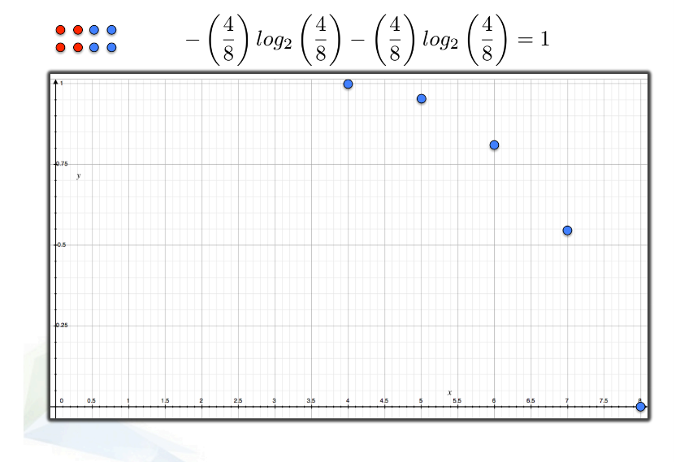
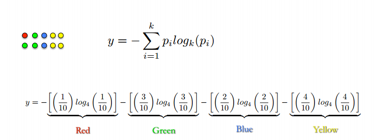
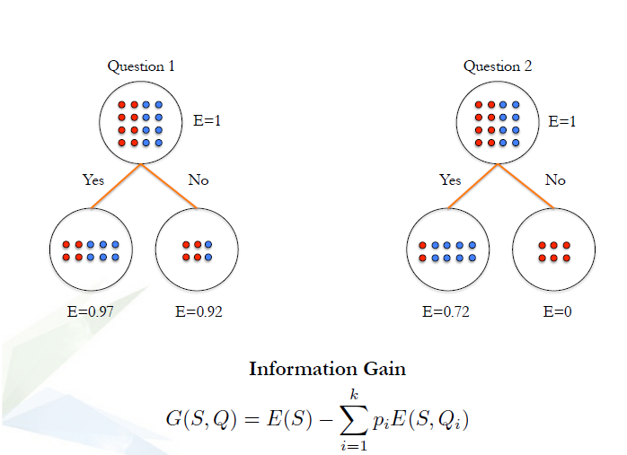
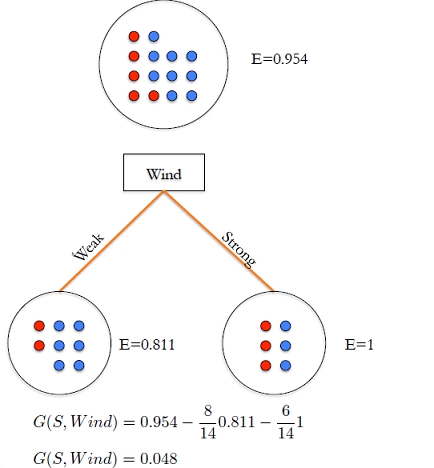
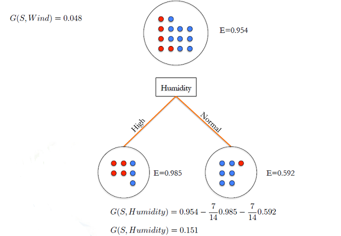
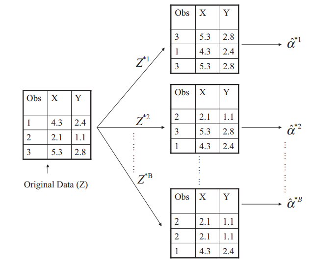

```{r setup, include=FALSE}
knitr::opts_chunk$set(echo = FALSE)
```

## Aims of this lesson

* Understand what are decision trees (DT), random forests (RF) and gradient boosting (GB), how they works, and how to evaluate a DT a RF or a GB model.

* Decision tree is a type of supervised learning algorithm (having a pre-defined target variable) mostly used in classification problems.

* It works for both categorical and continuous input and output variables.

* In this technique, we split the population or sample into two or more homogeneous sets (or sub-populations) based on most significant splitter$/$differentiator in input variables.

# Decision trees
## A decision tree example 

{width=60%}

## A decision tree example 

{width=60%}

## A decision tree example 

{width=70%}


## A decision tree example 


{width=70%}


## A decision tree example 


{width=70%}

## A decision tree example 


{width=70%}


## Types of decision trees

+ __Classification decision tree:__ Decision trees which have categorical target variable

    + Models suitable for answering questions: Which category(ies)  


+ __Regression trees:__ decision trees that have continuous target variable 

    + Models suitable for answering questions: How mach, how many 
     
##  Terminology related to decision trees
 
1. __Root Node:__ It represents entire population or sample and this further gets divided into two or more homogeneous sets.

2. __Splitting:__ It is a process of dividing a node into two or more sub-nodes.

3. __Decision Node:__ When a sub-node splits into further sub-nodes, then it is called decision node.

4. __Leaf/ Terminal Node:__ Nodes do not split is called Leaf or Terminal node.

5. __Pruning:__ When we remove sub-nodes of a decision node, this process is called pruning. You can say opposite process of splitting.

6. __Branch / Sub-Tree:__ A sub section of entire tree is called branch or sub-tree.

7. __Parent and Child Node:__ A node, which is divided into sub-nodes is called parent node of sub-nodes where as sub-nodes are the child of parent node.


##  Terminology related to decision trees


{width=70%}


## Advantages & disadvantages

### Advantages 


+ Easy to Understand:

+ Useful in data exploration: 

+ Less data cleaning required.

+ Data type is not a constraint.

+ Non parametric method.


### Disadvantages

+ Over fitting

+ Not fit for continuous variables


## How does a tree decide where to split?

{width=70%}


## How does a tree decide where to split?

{width=70%}


## How does a tree decide where to split?

{width=70%}


## How does a tree decide where to split?

{width=70%}


## How does a tree decide where to split?

{width=70%}


## How does a tree decide where to split?

{width=70%}

## How does a tree decide where to split?

{width=70%}


## How does a tree decide where to split?

{width=70%}


## How does a tree decide where to split?

{width=70%}


## How does a tree decide where to split?

{width=70%}


## How does a tree decide where to split?

{width=70%}


## How does a tree decide where to split?

{width=70%}


## How does a tree decide where to split?

{width=70%}


## How does a tree decide where to split?

{width=70%}


## How does a tree decide where to split?

{width=30%} 


## How does a tree decide where to split?

{width=50%}

## How does a tree decide where to split?

{width=50%}


## How does a tree decide where to split?

{width=50%}


## key parameters of tree modeling

+ Overfitting is one of the key challenges faced while modeling decision trees. 

+ If no limit set,  tree give you 100% accuracy on training set

+ Preventing overfitting is essential in fitting  a decision tree and it can be done in 2 ways:

    * Setting constraints on tree size
    * Tree pruning


## Setting constraints on tree size

{width=70%}

## Setting constraints on tree size

1. Minimum samples for a node split (`min_samples_split`)

    + Control over-fitting. Should be tuned using CV.

2. Minimum samples for a terminal node (leaf)

    + Control over-fitting similar to min_samples_split.

3. Maximum depth of tree (vertical depth, `max_depth`)

    + Control over-fitting Should be tuned using CV
    
4. Maximum number of terminal nodes
    
    + Can be defined in place of `max_depth`. In a binary tree, a depth of 'n' would produce a maximum of $2^{n+1} -1$ leaves.

5. Maximum features to consider for split


## Tree pruning 


1. Make the decision tree to a large depth.

2. Start at the bottom and start removing leaves which are giving us negative IG when compared from the top.


Suppose a split is giving us a gain of say -10 (loss of 10) and then the next split on that gives us a gain of 20. A simple decision tree will stop at step 1 but in pruning, we will see that the overall gain is +10 and keep both leaves.


## Are tree based models better than logistic models?

+ If the relationship between feature and label is well approximated by a linear model, linear regression will outperform tree based model.

+ If there is a high non-linearity andcomplex relationship between feature and label tree model will outperform a classical regression method.

+ If you need to build a model which is easy to explain to people, a decision tree model will always do better than a linear model. Decision tree models are even simpler to interpret than linear regression!


## Working with decision trees in R


__Go to the notebook__


# Evaluate model Performance 

## Predicting class labels for test data 

{width=60%}

## Evaluation metrics for binary classification 

* Accuracy 
* Confusion matrix 
* Log-loss
* AUC

## Accuracy 


$$
accuracy = \frac{\# \space of \space correct \ prediction }{\# \ of \ total \ data \ points}
$$


## Confusion matrix  

{width=50%}

## Confusion matrix  

__true positives (TP)__: These are cases in which we predicted yes (Defalut), and they are Defaulted.

__true negatives (TN):__ We predicted will NOT default, and they will NOT default.

__false positives (FP):__ We predicted Defaulted, but they don't actually Defaulted. (Also known as a "Type I error.")

__false negatives (FN):__ We predicted NOT Defaulted, but they actually do NOT Defaulted. (Also known as a "Type II error.")

## Confusion matrix  

We fit a simple tree model  `default ~ balance+income+student` to the Default dataset from the ISLR package


## Confusion matrix  

Let calculate some metrics such as accuracy the hard way.


We may use the `table()` and `confusionMatrix()` from the `caret` library to quickly obtain many more metrics.


## Evaluation metrics for binary classification 

__Please complete "compute_confusion_matrix_lab.Rmd"__  


# Ensemble methods - Random Forests 

## What are ensemble methods in tree based modeling ?

__en-sem-ble__

A unit or group of complementary parts that contribute to a single effect, especially:

 * A coordinated outfit or costume.

 * A coordinated set of furniture.

 * A group of musicians, singers, dancers, or actors who perform together

## Bootstrapping

{width=70%}


## What is bagging? how does it work?

  1. **Create multiple data sets through bootstrapping:** Sampling is done with replacement on the original data and new datasets are formed.
    The new data sets can have a fraction of the columns as well as rows, which are generally hyper-parameters in a bagging model
    Taking row and column fractions less than 1 helps in making robust models, less prone to overfitting

  2. __Build multiple classifiers:__ Classifiers are built on each data set. Generally the same classifier is modeled on each data set and predictions are made.

  3. __Combine classifiers:__ The predictions of all the classifiers are combined using a mean, median or mode value depending on the problem at hand. The combined values are generally more robust than a single model.

## What is bagging? how does it work?


{width=70%}


## Out-of-Bag error estimation

* It turns out that there is a very straightforward way to estimate the test error of a bagged model.

* Recall that the key to bagging is that trees are repeatedly fit to bootstrapped subsets of the observations. One can
show that on average, each bagged tree makes use of around two-thirds of the observations.

* The remaining one-third of the observations not used to fit a given bagged tree are referred to as the out-of-bag (OOB) observations.

* We can predict the response for the _ith_ observation using each of the trees in which that observation was OOB. This will yield around $B/3$ predictions for the _ith_ observation, which we average.

* This estimate is essentially the LOO cross-validation error for bagging, if $B$ is large.


## Bagging the heart data

{width=70%}


## What is Random Forest ? How does it work?

  1. Assume number of cases in the training set is $N$. Then, sample of these $N$ cases is taken at random but with replacement. This sample will be the training set for growing the tree.

  2. If there are $M$ input variables, a number $m<M$ is specified such that at each node, $m$ variables are selected at random out of the $M$. The best split on these $m$ is used to split the node. The value of $m$ is held constant while we grow the forest.
  
  3. Each tree is grown to the largest extent possible and there is no pruning.
  Predict new data by aggregating the predictions of the ntree trees (i.e., majority votes for classification, average for regression).


## What is Random Forest ? How does it work?


{width=70%}


## Advantages of Random Forest


1. Random forest can solve both type of problems i.e. classification and regression and does a decent estimation at both fronts.

2. Random forest  can handle large data set with higher dimensionality. Further, RF models output Importance of variable, which can be a very usefull feature (on some random data set).

3. Computation of the out-of-bag error estimate removes the need for a set aside test set.

## Bagged trees vs. Random Forest

{width=100%}


## Random forrest 'R' implementation (`randomForrest`)

{width=100%}

## Random forrest 'R' implementation (`randomForrest`)

{width=80%}

__Please complete "intro_randomForest01.Rmd"__  

## Understanding the Random Forest model output

{width=80%}

## Out-of-bag error matrix 

{width=80%}

## Out-of-bag error estimate


{width=80%}

## Out-of-bag error estimate

{width=80%} 

__Please complete "evaluate_out_of_bag_error.Rmd"__

## OOB error vs. test set error

### Advantages

* Can evaluate your model without a separate test set  
* Compute automatically by the randomForest function 

### Disadvantages

* OOB error only estimate error (not other performance metrics such as AUC, log-loss, etc)

* can't compare RF performance to other types of models

## Advantage of OOB error

{width=80%} 

## Tuning a Random Forest model

* _ntree_: number of trees 
* _mtry_: number of predictors sampled for spliting at each node.
* _sampsize_: number of samples to train on
* _nodesize_: minimum size (number of samples) of the terminal nodes
* _maxnodes_: maximum number of terminal nodes

## Tuning `mtry` with tuneRF()

{width=80%} 

__Please complete "tuning_random_forest.Rmd"__

# Ensemble methods - Gradient Boosting

## Predict a person's age example 


We want to predict a person's age based on whether they play video games, enjoy gardening, and their preference on wearing hats. Our objective is to minimize squared error. We have these nine training samples to build our model.


{width=80%} 


## Predict a person's age example 

Intuitively, we might expect
- The people who like gardening are probably older
- The people who like video games are probably younger
- `LikesHats` is probably just random noise

We can do a quick and dirty inspection of the data to check these assumptions:

{width=100%} 


Now let's model the data with a regression tree. To start, we'll require that terminal nodes have at least three samples. With this in mind, the regression tree will make its first and last split on `LikesGardening`.


## Predict a person's age example

<center>

{width=60%} 

</center>

This is nice, but it's missing valuable information from the feature LikesVideoGames. Let's try letting terminal nodes have 2 samples.

## Example 

{width=60%} 


Here we pick up some information from `PlaysVideoGames` but we also pick up information from `LikesHats` - a good indication that we're overfitting and our tree is splitting random noise.

## Predict a person's age example

Suppose we measure the training errors from our first tree.

<center>

{width=100%} 

<center>


## Predict a person's age example

Now we can fit a second regression tree to the residuals of the first tree.

<center>

{width=50%} 

</center>


## Predict a person's age example

Now we can improve the predictions from our first tree by adding the "error-correcting" predictions from this tree.

<center>

{width=100%} 

 </center>
 
## Gradient Boosting - Theory 1

Inspired by the idea above, we create our first (naive) formalization of gradient boosting. In pseudocode

1. Fit a model to the data, $F_1(x) = y$
2. Fit a model to the residuals, $h_1(x) = y - F_1(x)$
3. Create a new model, 

It's not hard to see how we can generalize this idea by inserting more models that correct the errors of the previous model. 

## Gradient Boosting - Theory 1

Specifically,

$$F(x) = F_1(x) \mapsto F_2(x) = F_1(x)+h_1(x) \dots \mapsto$$ 
$$F_M(x) = F_{M-1}(x)+h_{M-1}(x)$$
where $F_1(x)$ is an initial model fit to $y$

Since we initialize the procedure by fitting $F_1(x)$, our task at each step is to find 

$$h_m(x) = y - F_m(x)$$.


## Gradient Boosting - Theory 2

Now we'll tweak our model to conform to most gradient boosting implementations - we'll initialize the model with a single prediction value. Since our task (for now) is to minimize squared error, we'll initialize $F$ with the mean of the training target values.
$$ F_0(x) = \underset{\gamma}{\arg\min} \sum_{i=1}^n L(y_i, \gamma) = \underset{\gamma}{\arg\min} \sum_{i=1}^n (\gamma - y_i)^2 = {\frac {1}{n}}\sum _{i=1}^{n}y_{i} $$
Then we can define each subsequent $F_m recursively$, just like before
$$ F_{m+1}(x) = F_m(x) + h_m(x) = y, for \thinspace \thinspace m \geq 0$$
where $h_m$ comes from a class of base learners $\mathcal{H}$ (e.g. regression trees).

## Gradient Boosting - Theory 3 Gradient Descent

Let's refresh this idea using the concept of gradient descent. Consider a differentiable function we want to minimize. For example,

$$ L(x_1, x_2) = \frac{1}{2}(x_1 - 15)^2 + \frac{1}{2}(x_2 - 25)^2 $$


The goal here is to find the pair $(x_1, x_2)$ that minimizes $L$. Notice, you can interpret this function as calculating the squared error for two data points, $15$ and $25$ given two prediction values, $x_1$ and $x_2$ (but with a $\frac{1}{2}$ multiplier to make the math work out nicely). Although we can minimize this function directly, gradient descent will let us minimize more complicated loss functions that we can't minimize directly.


## Gradient Boosting - Theory 3 Gradient Descent

Initialization Steps:
Number of iteration steps M = 100
Starting point $s^{0} = (0, 0)$
Step size $\gamma = 0.1$


For iteration $m=1 \to M$:

1. Calculate the gradient of $L$ at the point $s^{(m-1)}$

2. "Step" in the direction of greatest descent (the negative gradient) with step size $\gamma$. 

That is, 
$$s^m = s^{(m-1)} - \gamma \nabla L(s^{(m-1)})$$

If $\gamma$ is small and M is sufficiently large, $s^{M}$ will be the location of $L$'s minimum value.


## Leveraging Gradient Descent - Theory 4

Now we can use gradient descent for our gradient boosting model. 

The objective function we want to minimize is $L$. Our starting point is $F_0(x)$. 

For iteration $m = 1$, we compute the gradient of $L$ with respect to $F_0(x)$. 

Then we fit a weak learner to the gradient components. 

In the case of a regression tree, leaf nodes produce an average gradient among samples with similar features. 

For each leaf, we step in the direction of the average gradient (using line search to determine the step magnitude). The result is $F_1$. 

Then we can repeat the process until we have $F_M$.

## Leveraging Gradient Descent - Theory 4

Initialize the model with a constant value:
$$F_0(x) = \underset{\gamma}{\arg\min} \sum_{i=1}^n L(y_i, \gamma)$$

For m = 1 to M:

* Compute pseudo residuals,  $r_{im} = -\left[\frac{\partial L(y_i, F(x_i))}{\partial F(x_i)}\right]_{F(x)=F_{m-1}(x)} \quad \mbox{for } i=1,\ldots,n.$

* Fit base learner, $h_{m}(x)$ to pseudo residuals

* Compute step magnitude multiplier $\gamma_m$. 

* Update $F_m(x) = F_{m-1}(x) + \gamma_m h_m(x)$

## Leveraging Gradient Descent - Theory 4

In case you want to check your understanding so far, our current gradient boosting applied to our sample problem for  squared error yields the following results.


{width=100%}


## Leveraging Gradient Descent - Theory 4


{width=100%}


## Gradient Boosting in Practice

### Advantage 
* Incredibly effective in practice. 
* Often performs better than any other algorithm
* Directly optmizes cost function

### Disadvantage

* Overfits (need to find a proper stopping point)
* Sensitive to extreme values and noises

What else can it do? Although the example above presented gradient boosting as a regression model, 
it's also very effective as a classification problems


## Train a GBM Model in R 


{width=100%}

__Please complete "train_gbm_model.Rmd"__

## Understanding GBM model output

{width=100%}


## Variable importance

{width=100%}


## Variable importance

{width=100%}


## Prediction using GBM

{width=100%}


## Tuning a GBM model

### GBM Hyperparameters
* _n.trees:_ number of trees

* _bag.fraction:_ proportion of observations to be sampled in each tree

* _n.minobsinnode:_ minimum number of observations in the trees terminal nodes

* _interaction.depth:_ maximum nodes per tree

* _shrinkage:_ learning rate


## Early Stopping

{width=60%}

## Early Stopping in GBMs

{width=100%}


